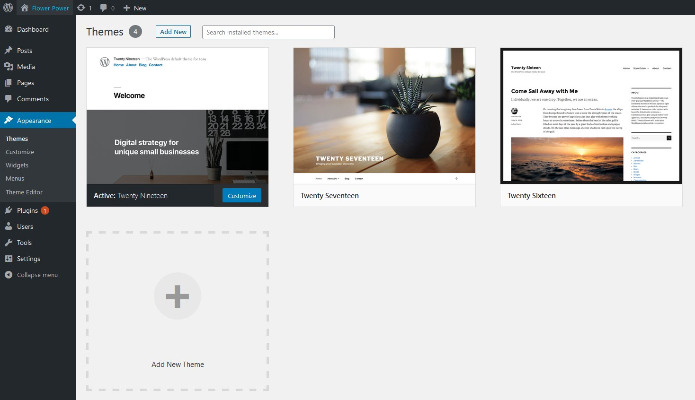

# Lesson 4 - Appearance

While posts and pages are all about content, they aren’t very focussed on how that content gets displayed to the user; this is set by the theme you choose. There are many different types of themes, some are free and some you pay for. The theme decides the styling of the page, the layout of the page, and what is customisable from the admin panel.

To add a theme you click ‘Add New Theme’, search for the theme you want and then install and activate. If you change the theme, navigate to your site by hovering over the name of your website in the top left and clicking ‘Visit site’ - you will see the content is displayed differently.

## Customizer

Under Appearances you will see an option to ‘Customize’ the website. Here you can adjust the theme to suit your brand. The options for customizing are set by your theme so each theme will be different, but usually will include options such as setting up your logo and site colours.

## Widgets

Widgets are small blocks which give specific functionality to parts of the site like the sidebar, header, footer etc. The areas of the site where widgets can be added is set by the theme. Common widgets might include search, recent posts, filters, calendar and more.

## Menus

To update the navigation for your website, you can go to the ‘Menus’ section. Here you can set what pages are shown on your site’s navigation and what order they appear in.

You can change the value of the text that appears in the links. You can create sub-menus by simply dragging the menu item to the right under its parent element.

---
- [Go to the module assignment](ma)
---
